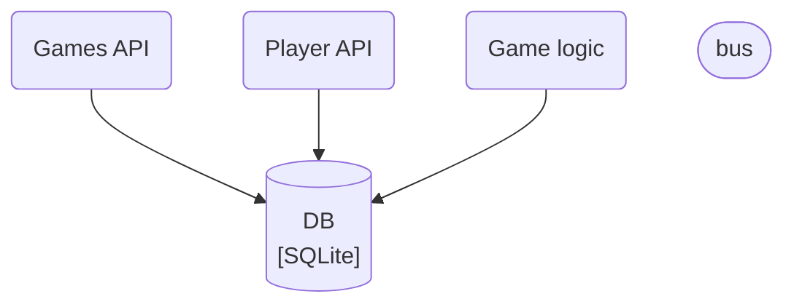

# Компонентная диаграмма (backend)

```mermaid
graph TD
    games-api("Games API")
    logic("Game logic")
    player-api("Player API")

    bus([bus])
    db[("DB<br>[SQLite]")]

    games-api --> db
    player-api --> db
    logic --> db
```