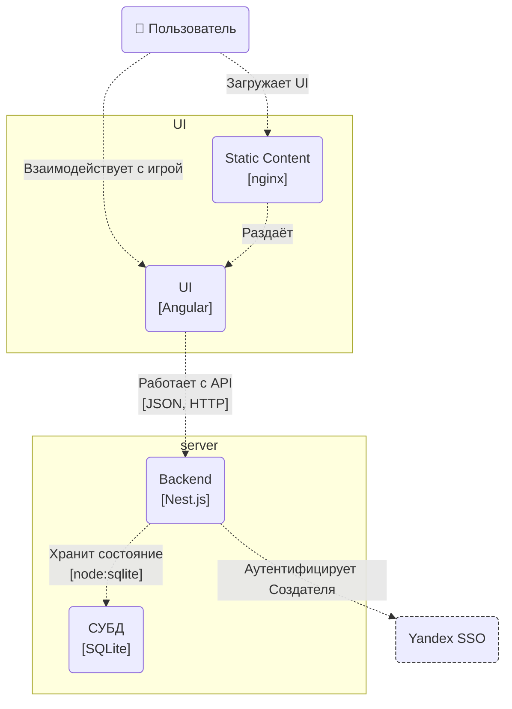

# Диаграмма контейнеров

```mermaid
graph TD
    user("👤 Пользователь")

    subgraph UI
        static("Static Content<br>[nginx]")
        frontend("UI<br>[Angular]")
    end

    subgraph server
        backend("Backend<br>[Nest.js]")
        database("СУБД<br>[SQLite]")
    end

    %% внешние системы:
    sso("Yandex SSO")

    %% связи:
    user -.->|"Загружает UI"| static
    user -.->|"Взаимодействует с игрой"| frontend
    static -.->|"Раздаёт"| frontend
    frontend -.->|"Работает с API<br>[JSON, HTTP]"| backend
    backend -.->|"Хранит состояние<br>[node:sqlite]"| database

    backend -.->|Аутентифицирует Создателя| sso

    style sso stroke:#333,stroke-dasharray: 4 2
```
