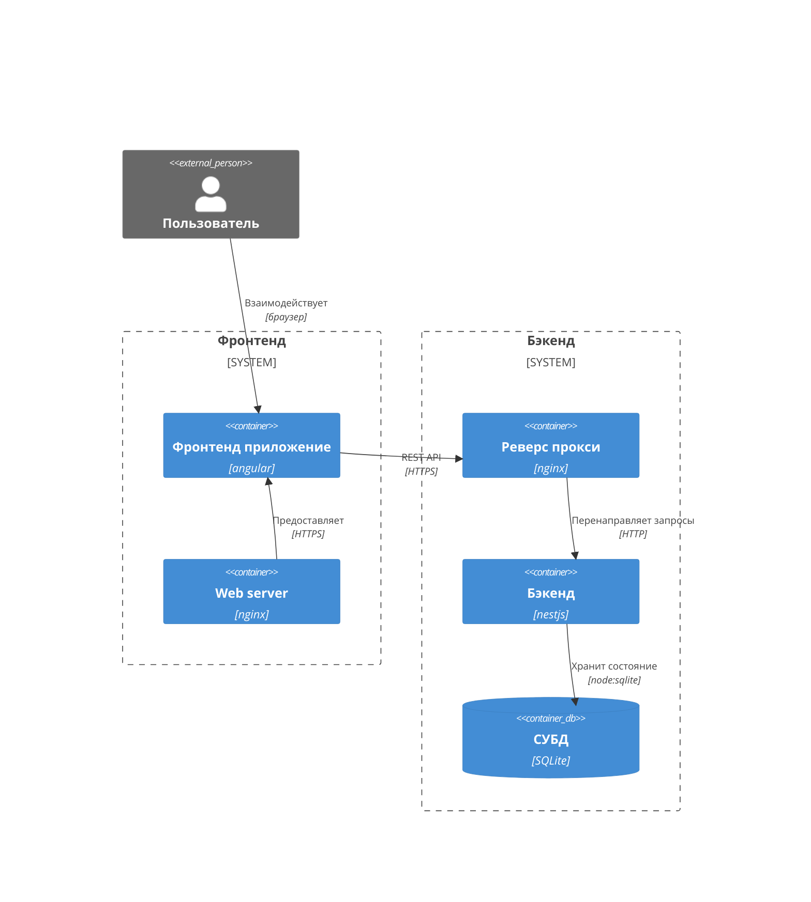

```mermaid
C4Container
    Person_Ext(user, "Пользователь")

    System_Boundary(b0, "Фронтенд") {
        Container(frontend, "Фронтенд приложение", "angular")
        Container(static, "Web server", "nginx")
    }

    System_Boundary(b1, "Бэкенд") {
        Container(gateway, "Реверс прокси", "nginx")
        Container(backend, "Бэкенд", "nestjs")
        ContainerDb(db, "СУБД", "SQLite")
    }

    Rel(user, frontend, "Взаимодействует", "браузер")
    Rel(static, frontend, "Предоставляет", "HTTPS")
    Rel(frontend, gateway, "REST API", "HTTPS")
    Rel(gateway, backend, "Перенаправляет запросы", "HTTP")
    Rel(backend, db, "Хранит состояние", "node:sqlite")

    UpdateLayoutConfig($c4ShapeInRow="1")

    %% костыли для бета-версии диаграммы
    UpdateRelStyle(user, frontend, $offsetY="-30")
```