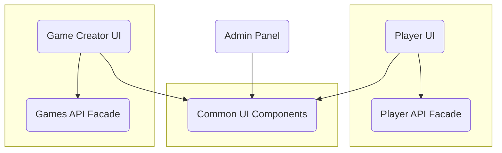

# Компонентная диаграмма (frontend)

```mermaid
graph TD
    subgraph player-slice[" "]
        player("Player UI")
        player-api("Player API Facade")
    end

    subgraph creator-slice[" "]
        creator("Game Creator UI")
        creator-api("Games API Facade")
    end

    admin("Admin Panel")

    subgraph shared-slice[" "]
        shared("Common UI Components")
    end

    player --> shared
    player --> player-api
    creator --> shared
    creator --> creator-api
    admin --> shared
```
