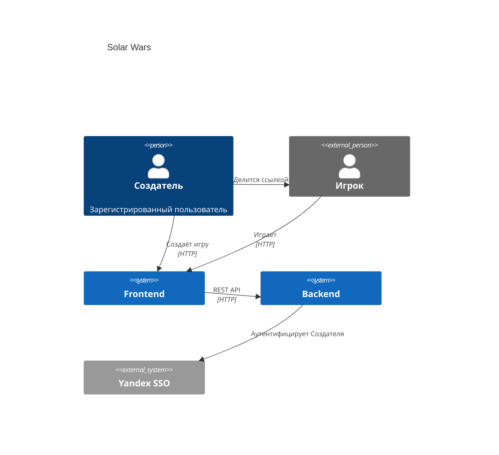

```mermaid
C4Context
    title Solar Wars

    Person(creator, "Создатель", "Зарегистрированный пользователь")
    Person_Ext(player, "Игрок")

    System(frontend, "Frontend")
    System(backend, "Backend")

    System_Ext(sso, "Yandex SSO")

    Rel(frontend, backend, "REST API", "HTTP")
    Rel(backend, sso, "Аутентифицирует Создателя")
    Rel(creator, frontend, "Создаёт игру", "HTTP")
    Rel(creator, player, "Делится ссылкой")
    Rel(player, frontend, "Играет", "HTTP")


    UpdateLayoutConfig($c4ShapeInRow="2")

    %% костыли для бета-версии диаграммы
    UpdateRelStyle(creator, player, $offsetY="-10", $offsetX="-50")
    UpdateRelStyle(frontend, backend, $offsetY="-10", $offsetX="-35")
```
