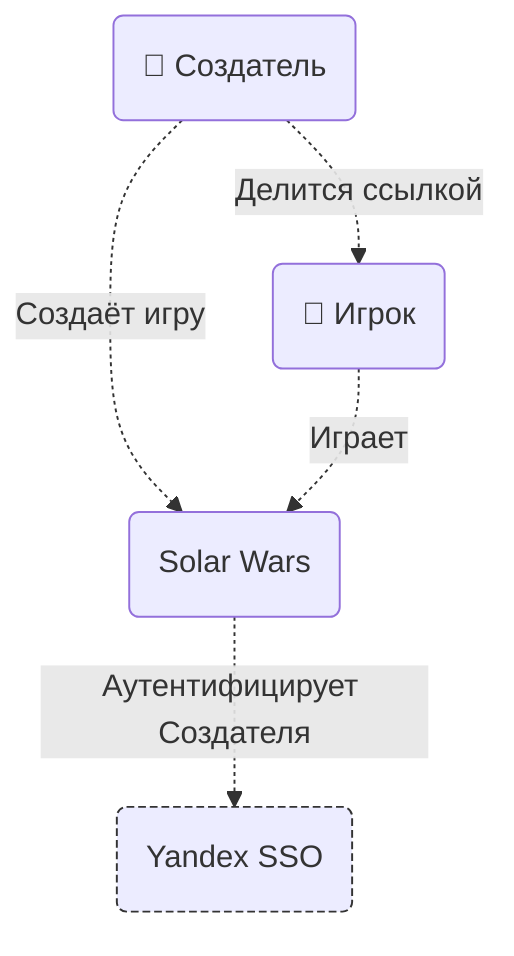

# Системная диаграмма

Контекст — пользователи и внешние системы.

```mermaid
graph TD
    creator("👤 Создатель")
    player("👤 Игрок")
    
    game("Solar Wars")
    sso("Yandex SSO")

    game -.->|Аутентифицирует Создателя| sso
    creator -.->|Создаёт игру| game
    creator -.->|Делится ссылкой| player
    player -.->|Играет| game


    %% Внешние системы отмечаем серой обводкой
    style sso stroke:#333,stroke-dasharray: 4 2
```